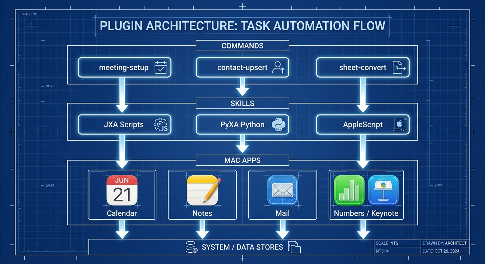
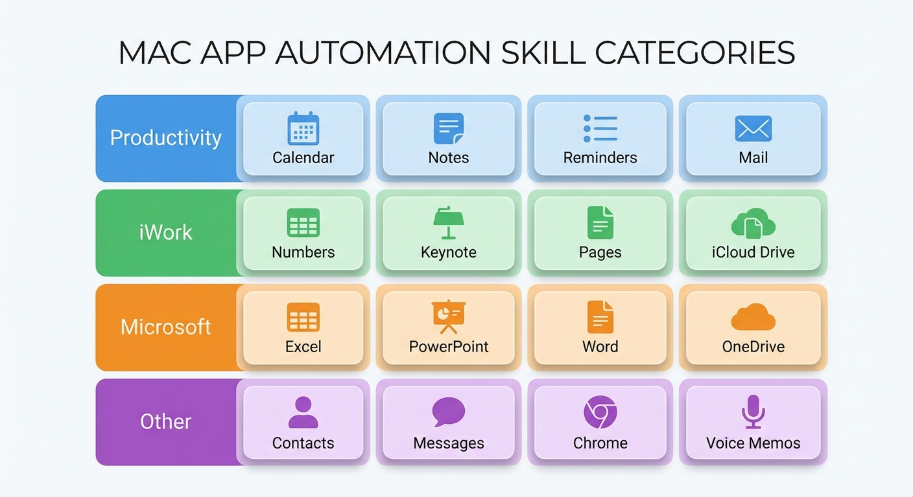
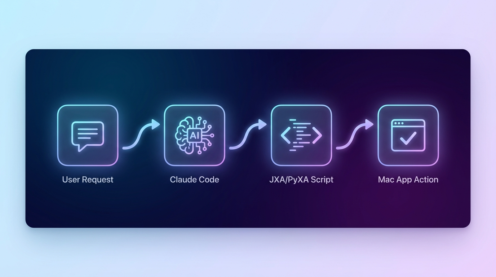

# Automating Mac Apps Plugin

Automates macOS apps via Apple Events using AppleScript (discovery), JXA (legacy), and PyXA/Python (preferred).
Includes skills for Calendar, Notes, Mail, Keynote, Numbers, Excel, Reminders, Contacts, and more.

> **Note**: This is a plugin for Claude Code. It is not ready for prime time yet. Only use it if you are a developer and want to help test it.
> I have tested it with Reminders, Keynote, Numbers, Notes, Contactc, Calendar, Messenger (send only), and Mail. It is useful as-is but please report any issues or suggestions.
> Tested Pages and it did not go well. We could only add basic text. We could paste in images but could not predict where they would end up in the doc. 
> Everything else is woefully short on testing. 

## What is this Plugin?

- Automates 16+ Mac applications from Claude Code
- Uses JavaScript for Automation (JXA) and Python (PyXA)
- Provides ready-to-use scripts and reference docs
- Includes commands, agents, and skills
- Installed from GitHub: SpillwaveSolutions/automating-mac-apps-plugin

### AI-Powered Mac Automation


*Connect your favorite Mac applications to Claude Code through Apple Events automation. Control Calendar, Notes, Mail, Keynote, Numbers, and more with natural language commands.*

### Plugin Architecture



*The plugin uses a three-layer architecture:*
- **Skills Layer**: 16 app-specific automation skills with recipes and reference docs
- **Commands Layer**: Ready-to-use slash commands for common workflows
- **Agents Layer**: Intelligent agents that combine multiple skills

### 16 Automation Skills



*Comprehensive coverage across productivity, communication, and development apps:*
- **Productivity**: Calendar, Reminders, Notes, Contacts
- **Office**: Numbers, Pages, Keynote, Excel, Word, PowerPoint
- **Communication**: Mail, Messages
- **Development**: Chrome, Web Browser Automation

### Automation Workflow



*How automation flows from your request to app control:*
1. Natural language request to Claude Code
2. Skill selection based on context
3. Script generation (JXA or PyXA)
4. Apple Events execution
5. App responds and returns results

## Installation

### Adding as a Marketplace 
```
/plugin marketplace add SpillwaveSolutions/automating-mac-apps-plugin  

```

### After adding marketplace then you can add skill

Once the plugin is available as a Claude Code marketplace:

```bash
claude plugins install automating-mac-apps-plugin
```

### Option 2: Install from GitHub

Clone directly into your Claude skills directory:

```bash
# Navigate to Claude skills directory
cd ~/.claude/skills

# Clone the repository
git clone https://github.com/SpillwaveSolutions/automating-mac-apps-plugin.git

# Or clone to a specific location and symlink
git clone https://github.com/SpillwaveSolutions/automating-mac-apps-plugin.git ~/projects/automating-mac-apps-plugin
ln -s ~/projects/automating-mac-apps-plugin ~/.claude/skills/automating-mac-apps-plugin
```

### Option 3: Manual Installation

1. Download or clone this repository
2. Copy the `plugins/automating-mac-apps-plugin/` folder to `~/.claude/skills/`

```bash
cp -r plugins/automating-mac-apps-plugin ~/.claude/skills/
```

## Verify Installation

After installation, verify the plugin is recognized:

```bash
# List installed plugins
claude plugins list

# Or check the skills directory
ls ~/.claude/skills/
```

## First-Run Setup (macOS Permissions)

Before using the automation skills, you need to grant macOS Automation permissions. Run the setup scripts to trigger permission prompts:

### All Apps at Once
```bash
cd ~/.claude/skills/automating-mac-apps-plugin
./skills/automating-mac-apps/scripts/request_automation_permissions.sh
# Or use Python:
python3 ./skills/automating-mac-apps/scripts/request_automation_permissions.py
```

### Per-App Setup
Run individual setup scripts as needed:

| App | Script |
|-----|--------|
| Calendar | `./skills/automating-calendar/scripts/set_up_calendar_automation.sh` |
| Notes | `./skills/automating-notes/scripts/set_up_notes_automation.sh` |
| Mail | `./skills/automating-mail/scripts/set_up_mail_automation.sh` |
| Keynote | `./skills/automating-keynote/scripts/set_up_keynote_automation.sh` |
| Numbers | `./skills/automating-numbers/scripts/set_up_numbers_automation.sh` |
| Excel | `./skills/automating-excel/scripts/set_up_excel_automation.sh` |
| Reminders | `./skills/automating-reminders/scripts/set_up_reminders_automation.sh` |
| Contacts | `./skills/automating-contacts/scripts/set_up_contacts_automation.sh` |
| Voice Memos | `./skills/automating-voice-memos/scripts/set_up_voice_memos_automation.sh` |

**Important**: Run scripts from Terminal or the Python interpreter you intend to use for automation. This ensures the correct app (Terminal.app or Python) receives permission approval.

## Plugin Contents

```
automating-mac-apps-plugin/
├── plugins/automating-mac-apps-plugin/   # Plugin payload
│   ├── .claude-plugin/
│   │   └── marketplace.json              # Plugin manifest
│   ├── skills/                           # 16 automation skills
│   │   ├── automating-mac-apps/          # Foundation + core patterns
│   │   ├── automating-calendar/
│   │   ├── automating-contacts/
│   │   ├── automating-excel/
│   │   ├── automating-keynote/
│   │   ├── automating-mail/
│   │   ├── automating-messages/
│   │   ├── automating-notes/
│   │   ├── automating-numbers/
│   │   ├── automating-pages/
│   │   ├── automating-powerpoint/
│   │   ├── automating-reminders/
│   │   ├── automating-voice-memos/
│   │   ├── automating-word/
│   │   ├── automating-chrome/
│   │   └── web-browser-automation/
│   ├── commands/                         # Slash commands
│   │   ├── /csv-to-numbers
│   │   ├── /csv-to-excel
│   │   ├── /excel-to-numbers
│   │   ├── /numbers-to-excel
│   │   ├── /sheet-report
│   │   ├── /doc-to-deck
│   │   ├── /contact-upsert
│   │   ├── /meeting-setup
│   │   ├── /meeting-start
│   │   └── /meeting-end
│   ├── agents/                           # Automation agents
│   ├── AGENTS.md
│   ├── README.md
│   └── LICENSE
├── tests/                                # Test suite (not shipped)
├── pyproject.toml                        # Poetry config for tests
└── README.md                             # This file
```

## Usage Examples

Once installed, Claude Code automatically loads relevant skills based on context. You can also invoke commands directly:

```
# Convert CSV to Numbers spreadsheet
/csv-to-numbers data.csv

# Create a Keynote presentation from a document
/doc-to-deck report.md

# Set up a meeting with calendar event, notes, and reminders
/meeting-setup "Project Kickoff" tomorrow 2pm
```

Or ask Claude naturally:
- "Create a Numbers spreadsheet from this CSV data"
- "Send an email to the team about tomorrow's meeting"
- "Add a reminder to follow up next week"
- "Export this Keynote to PDF"

## Development

This workspace includes a test suite for contributors:

```bash
# Install test dependencies
poetry install --with test

# Run tests
poetry run pytest
```

See `README-tests.md` for detailed testing instructions.

## Requirements

- macOS 10.15+ (Catalina or later)
- Claude Code CLI
- Python 3.10+ (for PyXA-based automation)
- Apps you want to automate (Calendar, Mail, Numbers, etc.)

## License

MIT License - see [LICENSE](plugins/automating-mac-apps-plugin/LICENSE).

## Contributing

Contributions welcome! Please read the development section above and ensure tests pass before submitting PRs.
